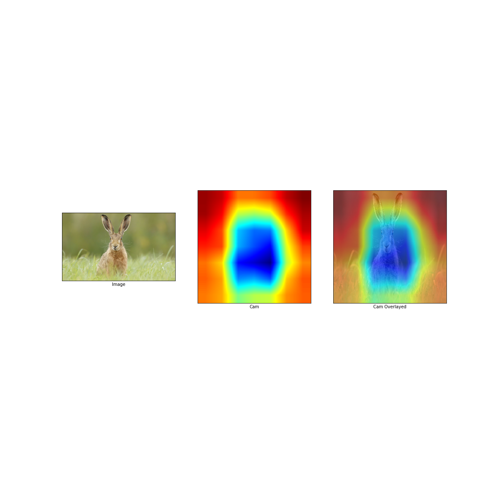

# GradCam

Tensorflow 2.2.0 Implementation of [Grad-CAM: Visual Explanations from Deep Networks
via Gradient-based Localization](https://arxiv.org/pdf/1610.02391.pdf).

## Results

Cats through the eyes of VGG19 :P

### VGG16

### VGG19

### ResNet 50

### ResNet 101

